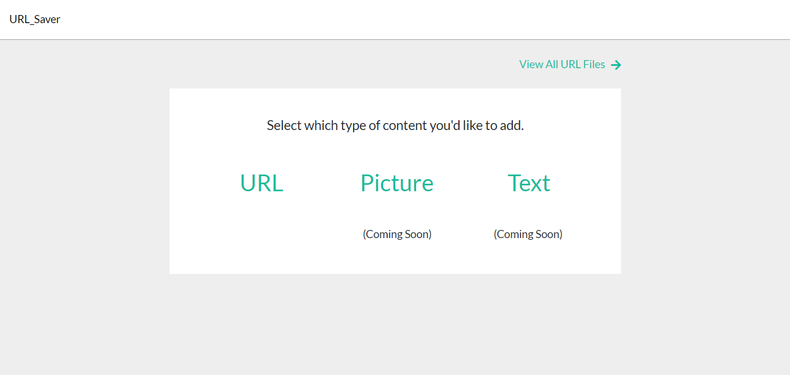

# URL Saver 

<p>
  <a href="https://peaceful-tundra-98649.herokuapp.com/" target="_blank">Use Live Application Here</a>
  ·
  <a href="https://drive.google.com/file/d/1Q4PwqZI2R7iV9vpKLArJt71wk_1g7Kxa/view?usp=sharing" target="_blank">View Demo</a>
  <br/>
</p>


<!-- TABLE OF CONTENTS -->
## Table of Contents

* [About the Project](#about-the-project)
  * [Built With](#built-with)
* [Getting Started](#getting-started)
* [Usage](#usage)
* [Contributing](#contributing)
* [Contact](#contact)
* [Acknowledgements](#acknowledgements)


<!-- ABOUT THE PROJECT -->
## About The Project



URL_Saver is a full-stack application created to keep track of URL's. A common occurrence is copy and pasting a URL into the notes section of an iPhone to be saved for later and then never being able to find it again. To prevent this, URL_saver allows the user to create multiple files with different topics and save URL's to them for quick and easy access later.

I wanted to build this application to 1.) Be able to save and find URL's and 2.) Further my expereince using a MySQL database and better understand how relational databases are structured and work. 

<a href="https://peaceful-tundra-98649.herokuapp.com/" target="_blank">Use Live Application Here</a>


### Built With

* [React](https://reactjs.org/)
* [JavaScript](https://www.javascript.com/)
* [Bootstrap](https://getbootstrap.com)
* [reactstrap](https://reactstrap.github.io/)
* [axios](https://www.npmjs.com/package/axios)
* [Node.js](https://nodejs.org/en/)
* [express](https://www.npmjs.com/package/express)
* [body-parser](https://www.npmjs.com/package/body-parser)
* [MySQL](https://www.mysql.com/)
* [Sequelize](https://sequelize.org/)


<!-- GETTING STARTED -->
## Getting Started

1. Clone the repo
```sh
git clone https://github.com/austingwalker/url_saver.git
```
2. Install NPM packages
```sh
npm install OR yarn install
```
3. Start the application on your local machine
```sh
npm start OR yarn start
```


<!-- USAGE EXAMPLES -->
## Usage

<a href="https://drive.google.com/file/d/1Q4PwqZI2R7iV9vpKLArJt71wk_1g7Kxa/view?usp=sharing" target="_blank">View Demo Here</a>


<!-- CONTRIBUTING -->
## Contributing

Any contributions you make are **greatly appreciated**.

1. Fork the Project
2. Create your Feature Branch (`git checkout -b feature/NewFeature`)
3. Commit your Changes (`git commit -m 'Add some NewFeature'`)
4. Push to the Branch (`git push origin feature/NewFeature`)
5. Open a Pull Request


<!-- CONTACT -->
## Contact

Austin Walker - [LinkedIn](https://www.linkedin.com/in/austin-walker-aa0aab129/) - agwalker249@gmail.com

Project GitHub Link: [https://github.com/austingwalker/url_saver](https://github.com/austingwalker/url_saver)

Live Application Link: [https://peaceful-tundra-98649.herokuapp.com/](https://peaceful-tundra-98649.herokuapp.com/)


<!-- ACKNOWLEDGEMENTS -->
## Acknowledgements
* [Heroku](https://www.heroku.com/)